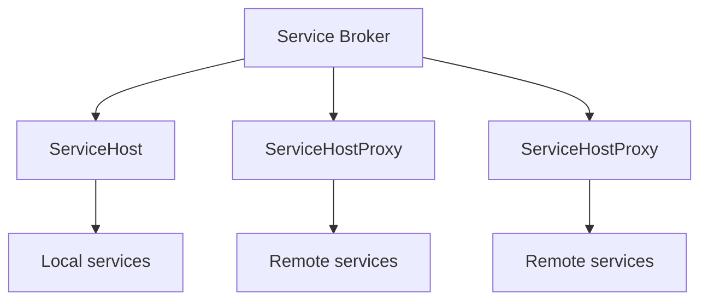
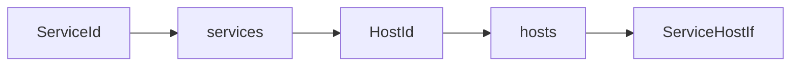
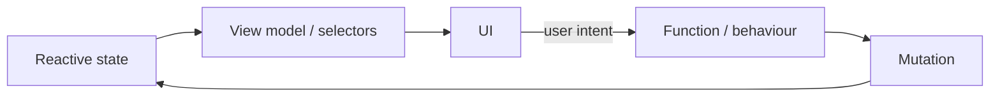
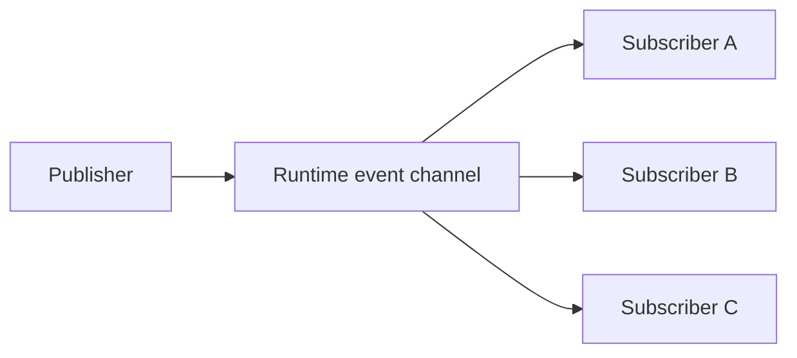
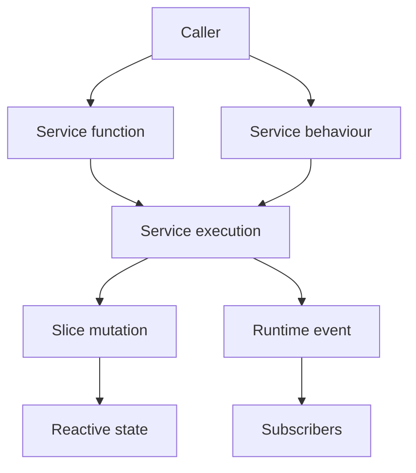

# Runtime Coordination Rework

## Purpose

This proposal describes a rework of the Service Bus and State Manager into a single runtime subsystem.

The current specifications define these as separate subsystems, but their implementations are closely coupled: services need access to state-management facilities, while state management is implemented using the Service Bus's execution and messaging infrastructure. The boundary has consequently become both difficult to maintain and difficult to reason about.

The proposed rework establishes a unified **runtime coordination** subsystem responsible for distributed service execution, reactive shared state, and transient event communication.

This document is a design proposal to inform the specification workflow. It is **not normative**. Existing specifications remain authoritative until they are deliberately revised through that workflow.

---

## Motivation

The current implementation has reached the point where it is being exercised by the browser-based frontend. This has exposed a significant number of integration bugs and unexpected interactions between the Service Bus and State Manager.

The current implementation has also accumulated substantially more complexity than an earlier prototype.

The earlier prototype under `/prior-art/bus` provides an important reference point. It implements most of the functionality currently provided by the Service Bus and State Manager in a comparatively small and straightforward architecture, and has been substantially tested.

The prototype should not be treated as normative or assumed to represent the final architecture. However, its design, implementation, and tests provide useful evidence about:

* which mechanisms are actually necessary;
* which abstractions compose naturally;
* which complexity may be accidental rather than fundamental;
* and which implementation properties are worth preserving.

The objective is therefore not simply to "rewrite the Service Bus", but to establish a simpler and more coherent runtime model and then implement it.

---

# Proposed architecture

The Service Bus and State Manager should become a single runtime subsystem.

The subsystem provides three related capabilities:

1. **service execution** — invoking and dispatching executable capabilities;
2. **reactive state** — maintaining shared state and its legal transitions;
3. **event communication** — publishing transient events to interested consumers.

The subsystem should expose a declaration-driven programming model rather than requiring consumers to interact directly with its transport and replication mechanisms.

The principal concepts proposed are:

* **services**;
* **functions**;
* **behaviours**;
* **slices**;
* **mutations**;
* **events**.

The precise semantics of these concepts should be established by the specification workflow.

---

# Services

A service is a named collection of executable capabilities.

Services continue to be declared separately from their implementations, using Zod schemas to define their externally visible interfaces. This preserves the existing Service Bus's useful separation between declaration, implementation, and dispatch. The current Service Bus already uses Zod 4 validation at the service boundary and promise-based caller interfaces. 

A service may expose two kinds of capability.

## Functions

A function is a request/response operation.

The caller supplies parameters and receives a result.

Conceptually:

```text
caller ── request ──> service
caller <── result ─── service
```

Functions are appropriate where the caller has a continuing interest in the result.

## Behaviours

A behaviour is a fire-and-forget operation.

The caller requests that the service perform an operation but does not await a result.

Conceptually:

```text
caller ── message ──> service
                         │
                         └── execution
```

Behaviours are analogous to actions in systems such as Vuex or messages in an actor model.

A behaviour is deliberately distinct from a function whose result happens not to be used. The runtime should provide explicit semantics for fire-and-forget dispatch.

Questions including delivery guarantees, failure handling, ordering and lifecycle should be resolved during the specification workflow.

---

# Hosts

The broker should coordinate service hosts rather than acting as a service host itself.

A host represents an execution context in which one or more services execute.

There should be a common interface:

```ts
interface ServiceHostIf {
    // host operations
}
```

with both local and remote implementations:

```text
ServiceHost
    executes services in the local execution context

ServiceHostProxy
    represents a ServiceHost executing in another context
```

The broker therefore does not need to implement the host interface merely because it happens to share an execution context with one host.

Instead, the broker owns the topology.

Conceptually:



The important architectural distinction is:

> **The broker manages where things execute. A host manages what executes there.**

---

# Broker topology

The broker should maintain two explicit mappings:

```ts
services: Record<ServiceId, HostId>
hosts: Record<HostId, ServiceHostIf>
```

The first maps a service identity to the host responsible for executing it.

The second maps a host identity to an endpoint representing that host.

Service resolution therefore becomes:



`ServiceHost` and `ServiceHostProxy` are interchangeable from the broker's perspective.

This makes execution locality an explicit property of the runtime topology rather than an implicit property of the object holding a service.

It also allows service identity and execution location to vary independently.

---

# Slice declarations

Shared reactive state should be divided into named **slices**.

A slice declaration defines:

* a unique name;
* a Zod schema describing the slice's state;
* a collection of named mutations.

Conceptually:

```text
Slice
├── name
├── state schema
└── mutations
    ├── mutation A
    │   ├── parameter schema
    │   └── state transition
    ├── mutation B
    │   ├── parameter schema
    │   └── state transition
    └── ...
```

A mutation declares a parameter type using Zod and defines a state transition:

```text
(state, parameter) → state
```

The mutation therefore describes a semantic transition to state rather than exposing a mechanism for constructing patches.

---

# Mutation execution

Mutations should be expressed at the architectural level as state-transition functions.

The implementation may execute mutations using Immer's drafting mechanisms:

```text
mutation
    ↓
Immer draft
    ↓
next state + patches
```

The resulting patches may then be used as the replication mechanism.

This preserves an important property of the existing State Manager: local state can remain immutable and reactive while updates are propagated efficiently as Immer patches. The current specification already establishes authoritative state, local immutable copies, patch propagation and sequence-based recovery. 

The distinction should therefore be:

> **Mutations are the semantic state-transition mechanism; Immer patches are an implementation mechanism for representing and propagating the resulting transition.**

Callers should not ordinarily need to construct Immer patches themselves.

---

# State authority

The unified runtime should retain the existing architectural principle that there is a single authoritative state.

A mutation submitted against a slice should be evaluated by the appropriate authority and, if accepted, become part of authoritative state.

Accepted changes should propagate to the local reactive state held by other execution contexts.

The exact authority, concurrency, ordering and replication protocol should be established during the specification workflow.

The existing `BroadcastChannel`/patch mechanism is a candidate implementation mechanism rather than a requirement of this proposal.

---

# Reactive state

Each execution context should expose a reactive local representation of the state it can observe.

The UI should consume this state reactively.

The intended UI architecture is therefore MVVM/Flux-like:



The UI should render the state rather than receiving imperative instructions to update individual presentation elements.

This establishes a clean separation:

* mutations change state;
* reactive state invalidates dependent computations;
* view models derive presentation state;
* UI components render that state.

---

# Runtime events

The runtime may provide a generic pub/sub mechanism for transient events.

A runtime event represents an occurrence that interested consumers may observe.

Conceptually:



Runtime events are distinct from persistent state.

They are also distinct from the Guide's agentic event queue.

The runtime should provide generic event transport without assigning domain-specific meaning to events.

Questions including event ordering, delivery guarantees, subscription lifetime and replay should be established separately.

---

# Relationship to the agentic event system

The existing Event System specification currently defines the Guide's event queue, probabilistic triggering, flushing and budget policy. 

This proposal does **not** intend to redesign those semantics.

The event queue belongs to the agentic model and should be treated as a consumer of runtime communication infrastructure.

As part of preparation for this rework, the event queue and its associated agentic semantics should be consolidated into the Constrained Agent specification. This would remove the current ambiguity in the word "event" and make the boundary explicit.

The desired conceptual distinction is:

```text
Runtime event
    transient communication mechanism

Agent stimulus / event
    semantic occurrence presented to the Guide

Agent event queue
    Guide's accumulated stimuli awaiting interaction
```

The precise terminology should be established during that specification work.

---

# Service and state interaction

The unified runtime should allow service execution and state transitions to compose naturally.

A service may, where permitted by the eventual specification:

* invoke another service function;
* dispatch a service behaviour;
* perform a slice mutation;
* publish a runtime event.

This produces a common runtime model:



The exact permissions and transactional relationships between these operations are open questions.

---

# Declaration-driven API

The proposed architecture should make declarations the principal source of runtime structure.

A service declaration describes executable capabilities.

A slice declaration describes state and its legal transitions.

The runtime can consequently derive much of its routing, validation and typing from declarations rather than maintaining independent descriptions of the same concepts.

This should also provide a natural foundation for generating typed client interfaces.

---

# Design principles

The rework should be guided by the following principles.

### Preserve semantic simplicity

The runtime should prefer a small number of explicit mechanisms over layers of abstraction that merely redistribute complexity.

### Separate topology from execution

The broker should manage runtime topology.

Hosts should manage service execution.

Services should interact with their runtime through an appropriately narrow execution interface.

### Make state transitions semantic

Callers should request named mutations rather than manipulate replication patches directly.

### Keep transport beneath the programming model

Message envelopes, worker communication, `BroadcastChannel`, transferable objects and patch formats should remain implementation mechanisms unless an observable property makes them architecturally significant.

### Preserve useful properties of the earlier prototype

The earlier prototype should be treated as an important design reference. Where it provides a simple, tested mechanism satisfying the required behaviour, the new implementation should prefer retaining its useful properties unless the new architecture provides a concrete reason to change them.

### Avoid speculative generalisation

The rework should not introduce abstractions merely because future requirements might eventually need them.

### Keep domain semantics out of infrastructure

The runtime should provide generic coordination mechanisms without acquiring knowledge of the semantics of the Guide, UI, content model or other consumers.

---

# Relationship to the earlier prototype

The earlier prototype under `/prior-art/bus` provides a substantial implementation reference for this work.

A review of the prototype should identify:

* its principal abstractions;
* its invariants;
* its service lifecycle;
* its message flow;
* its state propagation model;
* its testing coverage;
* its particularly simple or well-factored mechanisms;
* functionality subsequently added to the current implementation;
* limitations that the new architecture must address.

The prototype should not be copied mechanically.

In particular, the rework should distinguish:

> **properties of the design worth preserving**

from:

> **implementation choices that were merely incidental to the prototype.**

A separate design review by the implementation agent may be useful as input to this proposal and the subsequent specification workflow.

---

# Open questions

The following questions should be resolved through the specification workflow rather than assumed by implementation:

* What exactly constitutes a service function versus a behaviour?
* What delivery and failure guarantees apply to behaviours?
* What capabilities should be exposed to executing services?
* Should services be permitted to invoke mutations directly?
* How is mutation authority selected?
* What are the concurrency semantics for mutations?
* Are mutations serialised globally, per slice, or by some other mechanism?
* What replication guarantees are required?
* What is the lifecycle of a `ServiceHost`?
* How are services registered and deregistered?
* How are hosts activated and deactivated?
* What are the semantics of runtime event publication?
* What ordering and delivery guarantees apply to events?
* How are subscriptions represented and managed?
* What, if anything, should be shared between the service and slice declaration systems?
* Which aspects of the existing Service Bus protocol remain architecturally significant?
* Which parts of the existing State Manager protocol can become implementation details?

---

# Non-goals

This proposal does not seek to redesign:

* the Guide's constrained-agent behaviour;
* the Guide's event-triggering policy;
* the Guide's budget policy;
* the three-way interaction model;
* the content model;
* content retrieval;
* safety policy;
* UI presentation architecture beyond its relationship with reactive state;
* backend/serverless architecture.

These systems may consume or depend upon runtime coordination, but their domain semantics remain owned by their respective specifications.

---

# Intended outcome

The desired result is a runtime subsystem whose conceptual model can be summarised as:

```text
Service
├── Function
└── Behaviour

Slice
├── State
└── Mutation

Runtime
├── Service execution
├── State coordination
└── Event publication
```

with the implementation retaining the useful directness of the earlier prototype while providing the richer declaration and interaction model required by the current architecture.

The rework should result in **less conceptual coupling, not merely different coupling**.
