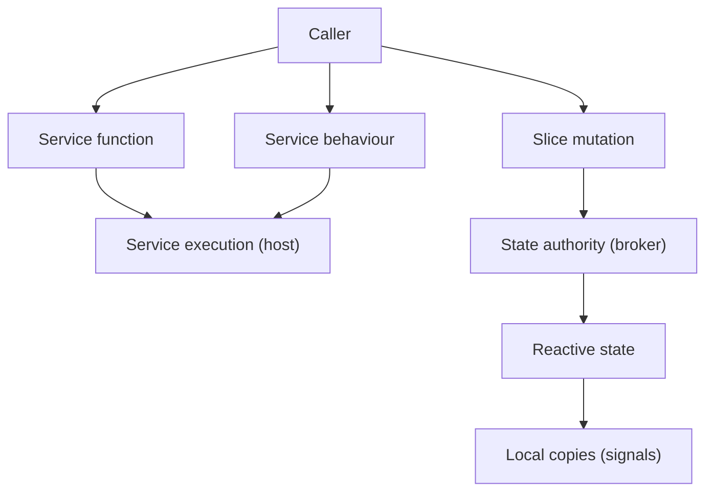

# Runtime

## Purpose and scope

This specification defines the runtime: the frontend subsystem that provides distributed service execution, reactive shared state, and the communication substrate over which the Guide's tool calls are dispatched, the agentic model operates, and the retrieval interface is accessed.

It governs:

- the `ServiceBroker`, `ServiceHost`, and `RuntimeClient` architecture;
- the service host topology, including the broker's local host and on-demand service host workers;
- service registration, on-demand activation, and initialization;
- the service interface contract — functions and behaviours;
- the message envelope structure and routing;
- Transferable object handling;
- promise resolution and error propagation;
- shared state — slices, mutations, the state authority, local copies, and the state-change propagation protocol;
- the declaration-driven programming model — service declarations, slice declarations, and typed proxies;
- message ordering and the initializer protocol;
- the policy parameters owned by this specification.

It is explicitly out of scope for this specification to define:

- the specific services that run on the runtime (retrieval, UI control, avatar interaction, the Guide agent loop, etc.) — which are defined by their respective domain specifications;
- the constrained agent — including the agentic model, tool-call discipline, tool categories, and budget — which is defined by [Constrained agent](./constrained-agent.spec.md);
- the content model and retrieval interface — which are defined by [Content model](./content-model.spec.md) and [Content-first retrieval](./content-first-retrieval.spec.md);
- the three-way interaction model — the roles of the actors, the permitted interface operations, and the conflict-resolution rules — which is defined by [Three-way interaction](./three-way-interaction.spec.md);
- the `interface` slice's concrete fields and conflict-resolution invariants — which are established by [UI](./ui.spec.md) as a refinement of this specification;
- the runtime topology — which subsystems run in which workers — which is defined by [Usage and deployment](./usage-and-deployment.spec.md);
- the concrete field schemas and invariants of the `interface` and `session` slices — which are established by refinement of this specification.

Where this specification depends on behaviour defined by those specifications, it links to them and states its requirement in terms of their observable behaviour.

## Design context

Darkling runs across the main thread and several Web Workers, as defined by [Usage and deployment](./usage-and-deployment.spec.md). Several threads need to execute capabilities (service calls), maintain a consistent view of live state (shared reactive state), and dispatch fire-and-forget operations (behaviours). The runtime provides these three capabilities as a single, declaration-driven subsystem.

The runtime follows a Flux/Vuex-like model:

- **services** provide executable capabilities — **functions** (request/response) and **behaviours** (fire-and-forget);
- **slices** define shared reactive state and its legal transitions — **mutations** are the only mechanism for changing shared state;
- the runtime **broker** coordinates service execution and hosts the state authority;
- each thread holds a **local copy** of shared state, exposed reactively through signals;
- **actions** (service functions) may orchestrate: calling other services, dispatching behaviours, committing mutations, and returning results;
- **mutations** are semantic state-transition functions; the runtime derives patches internally and propagates changes to observers.



## Architecture

The runtime consists of a `ServiceBroker`, zero or more `ServiceHost` instances, and a `RuntimeClient` available to callers.

### ServiceBroker

The `ServiceBroker` runs in a dedicated Web Worker. It is the central routing and coordination point for the runtime.

- The broker routes messages between runtime clients and service hosts.
- The broker maintains the service registry, as defined in [Service registration](#service-registration).
- The broker owns a **local `ServiceHost`** that executes services colocated with the broker (`onBroker: true`). The local host is a real `ServiceHost` instance, not a special mode of the broker.
- The broker decides when to launch a new service host worker and when to activate a service, and on which host, as defined in [On-demand activation](#on-demand-activation).
- The broker handles Transferable objects in message envelopes, as defined in [Transferable objects](#transferable-objects).
- The broker routes return and error messages back to the `RuntimeClient` that issued the corresponding call, correlated by message ID. The `RuntimeClient` handles promise resolution, as defined in [Promise resolution](#promise-resolution).
- The broker hosts the **state authority** — the colocated service that processes mutations and holds the authoritative copy of shared state, as defined in [State authority](#state-authority).

### ServiceHost

Each `ServiceHost` manages the activation, initialization, and dispatch of services within an execution context. A host may support multiple services.

- A host receives messages from the broker, dispatches them to the appropriate service, and returns results.
- A host is launched by the broker on demand. The broker's local host is created in-process; remote hosts run in dedicated service host workers.
- A host manages the activation state of each service it supports, including the initializer protocol, as defined in [Initialization](#initialization).
- A host processes messages to a given service strictly in delivery order, as defined in [Message ordering](#message-ordering).
- A host provides a `HostContext` to each service implementation, giving it access to the runtime, as defined in [Host context](#host-context).
- A host may be deactivated when idle, as an implementation concern.

The broker's local host and remote hosts (in service host workers) present the same interface to the broker: `activate`, `deactivate`, `dispatch`. The broker routes to a host uniformly regardless of whether it is local or remote.

### RuntimeClient

The `RuntimeClient` is the caller-side component of the runtime. It is available both on the main thread and to any service running on a host, enabling services to invoke other services and commit mutations.

- The `RuntimeClient` creates typed proxies on demand from service declarations, as defined in [Typed proxies](#typed-proxies).
- The `RuntimeClient` handles promise resolution: it issues calls to the broker, correlates return and error messages by message ID, and resolves or rejects the caller's promise, as defined in [Promise resolution](#promise-resolution).
- The `RuntimeClient` exposes low-level dispatch primitives (`call`, `behaviour`) for use by proxy factories, as defined in [Proxy factories](#proxy-factories).
- A caller — whether on the main thread or within a service — obtains a proxy from the `RuntimeClient` and invokes service functions and behaviours through it.

### Worker topology

The broker runs in a dedicated Web Worker. The broker's local host executes in the same worker. Each remote host runs in a dedicated service host worker. The `RuntimeClient` runs on the caller's thread — the main thread or within a service host's worker. This means:

- service execution is isolated from the main thread and from other services on different hosts;
- services on different hosts execute concurrently;
- the `RuntimeClient` is available wherever calls originate, without requiring a dedicated worker;
- communication between the `RuntimeClient`, broker, and hosts uses `postMessage` with message envelopes for remote hosts, and in-process dispatch for the local host;
- the state authority runs in the broker's local host, colocated with the broker, eliminating the need for a separate authority worker.

The location where a service is running — which host, whether the host is the broker's local host or a service host worker — is transparent to a consumer. A consumer invokes a service by its identifier; the broker routes the call to the appropriate host. The consumer must not depend on knowledge of which host executes a service.

## Service declarations

### Interface and metadata separate from implementation

Each service declares its interface and metadata separately from its implementation. The declaration is registered with the broker; the implementation runs on a host.

- A service declaration must include:
  - a **service identifier** — a unique name for the service;
  - **functions** — a record of named function declarations, each with parameter and return Zod schemas, as defined in [Service interface contract](#service-interface-contract);
  - **behaviours** (optional) — a record of named behaviour declarations, each with a parameter Zod schema and no return schema, as defined in [Service interface contract](#service-interface-contract);
  - an **implementation loader** — a function that asynchronously loads and returns the implementation class, as defined in [Declaration module and implementation loading](#declaration-module-and-implementation-loading);
  - **metadata** (optional) — service-level metadata used by the broker for routing and activation decisions.
- A service declaration may include:
  - an **initializer** — the name of a behaviour to be delivered before any other message to the service, as defined in [Initialization](#initialization);
  - a **proxy factory** — a function that produces a custom client-side proxy, as defined in [Proxy factories](#proxy-factories).
- The service implementation is not part of the declaration. The broker uses the declaration to route calls; the host loads and executes the implementation.

### Declaration module and implementation loading

A service's declaration and implementation are separate modules. The declaration module is the service's entry point; the implementation module is loaded lazily by the declaration's `implementationLoader`. This separation allows the broker, callers, and hosts to use the declaration (for routing, validation, typed proxies) without loading the implementation, and allows the host worker to load the implementation on demand when activating a service.

- The declaration module must export the `ServiceDeclaration` as a named `declaration` export. This is the convention by which the host worker obtains the declaration: it dynamically imports the declaration module and reads the `declaration` export.
- The `implementationLoader` must return a promise that resolves to the implementation's constructor — a class extending `ServiceImplementation`. The host instantiates the constructor with a `HostContext`, injecting runtime access at construction time.
- The `implementationLoader` must load the implementation module via dynamic `import()`, so that the implementation is not loaded until a host needs to activate the service. This keeps the implementation out of the initial bundle and allows it to be loaded on demand.
- The declaration module must not import the implementation module at module-load time. The declaration may import only the types and schemas needed to declare the service's interface; importing the implementation would defeat the lazy-loading purpose of the `implementationLoader`.

These requirements apply to all services, including those colocated with the broker. Although the broker's local host imports the declaration directly, the `RuntimeClient` on other threads (including the main thread) also imports declarations to generate proxies — the implementation must not be pulled into those contexts.

```gherkin
Feature: Declaration module and implementation loading
  Rule: The declaration and implementation are separate modules; the loader imports the implementation on demand

  Scenario: Host worker loads a declaration
    Given a service "retrieval" with declaration module "@darkling/knowledge-base/service"
    When the host worker dynamically imports the declaration module
    Then the module must export a named "declaration" export
    And the export must be a ServiceDeclaration

  Scenario: Implementation loaded lazily
    Given a service declaration with an implementationLoader
    When the host calls implementationLoader()
    Then the loader must return a promise for the implementation's constructor
    And the implementation module must not have been loaded before the call

  Scenario: Declaration module does not import the implementation
    Given a service's declaration module
    When the declaration module is imported
    Then the implementation module must not be loaded as a dependency
```

### Service metadata

Service metadata provides hints to the broker for routing and activation decisions.

- **`onBroker`** — if `true`, the service should be activated on the broker's local host. If `false` or omitted, the broker decides where to place the service, using other metadata and its own policy. The broker should respect this hint but may override it (e.g. if a service declares `onBroker: true` but has heavy resource requirements).
- **`capabilities`** — capabilities this service provides, for broker host-assignment decisions.
- **`hostRequirements`** — requirements for this service's host (e.g. specific APIs, worker configuration).

Additional metadata fields may be introduced by refinement.

### Service registry

The broker maintains a service registry of service declarations.

- Each service must be registered with the broker before it can be invoked.
- A service registration must include the service identifier and the module specifier of the declaration module. The registration may include service metadata.
- The registry maps service identifiers to their registration records (module specifier and metadata), not to specific host instances. The broker decides which host executes a service at dispatch time, as defined in [On-demand activation](#on-demand-activation).
- Registrations must be structured-cloneable, as they may cross worker boundaries via `postMessage`. Live declarations (carrying Zod schema objects) are not held by the broker; each host imports the declaration module to obtain live instances.

## Service interface contract

A service exposes two kinds of capability: **functions** and **behaviours**.

### Functions

A function is a request/response operation. The caller supplies parameters and receives a result.

```text
caller ── request ──> service
caller <── result ─── service
```

- **Parameter** — a single object, validated against the function's parameter schema.
- **Return** — a promise for a single object, validated against the function's return schema.
- **Schemas** — parameter and return types are expressed using Zod 4 schemas.

Functions are appropriate where the caller has a continuing interest in the result.

### Behaviours

A behaviour is a fire-and-forget operation. The caller requests that the service perform an operation but does not await a result.

```text
caller ── message ──> service
                         │
                         └── execution (queued for later)
```

- **Parameter** — a single object, validated against the behaviour's parameter schema.
- **No return** — a behaviour does not produce a result. The caller does not receive a promise.
- **Delivery guaranteed** — the runtime guarantees the behaviour reaches the target service's processing context. If the service is not active, the runtime activates it (including initialization if required) and delivers the behaviour.
- **No domain-level rejection** — unlike functions (which can fail with domain errors) and mutations (which can be rejected by invariants), behaviours have no domain-level failure to communicate back. The only failure is runtime failure (service unreachable, worker crash), which is reported through the runtime's error and observability infrastructure, not to the caller.
- **Queue for later** — the service controls when to act on the behaviour. The runtime delivers it; the service schedules the work. This is fundamentally different from a function, where the service processes the request immediately and returns a result.

Behaviours are distinct from functions whose results happen not to be used. The runtime does not allocate message-correlation state or expect a return envelope for behaviours.

```ts
// Zod 4 — declaration-level type illustration
interface ServiceFunctionDeclaration {
  params: z.ZodType;
  returns: z.ZodType;
  cost?: number;
  description?: string;
}

interface ServiceBehaviourDeclaration {
  params: z.ZodType;
  cost?: number;
  description?: string;
  // no returns field — behaviours do not produce results
}
```

### Validation

- The host must validate the parameter against the function or behaviour's parameter schema before dispatching. A parameter that fails validation must cause the call to be rejected with a validation error (for functions) or dropped with a runtime error (for behaviours).
- The host must validate the return value against the function's return schema before returning it. A return value that fails validation must cause the call to be rejected with a validation error.

```gherkin
Feature: Service interface contract
  Rule: Functions take an object and return a promise for an object; behaviours take an object and return nothing

  Scenario: Successful function invocation
    Given a service function with parameter schema P and return schema R
    When a caller invokes the function with a value matching P
    Then the function must execute
    And the return value must match R
    And the caller's promise must be fulfilled with the return value

  Scenario: Parameter validation failure
    Given a service function with parameter schema P
    When a caller invokes the function with a value not matching P
    Then the call must be rejected with a validation error
    And the caller's promise must be rejected

  Scenario: Behaviour dispatch
    Given a service behaviour with parameter schema P
    When a caller dispatches the behaviour with a value matching P
    Then the runtime must deliver the message to the service
    And the caller must not receive a promise or return value

  Scenario: Behaviour with invalid parameters
    Given a service behaviour with parameter schema P
    When a caller dispatches the behaviour with a value not matching P
    Then the runtime must not deliver the message to the service
    And a runtime error must be reported
```

## On-demand activation

The broker decides when to launch a new host and when to activate a service, and on which host.

- When a call or behaviour is directed to a service, the broker determines whether a host capable of executing the service is already active. If not, the broker launches a new service host worker (or activates the service on its local host if `onBroker: true`) before dispatching the message.
- A host may support multiple services. The broker may activate a service on an existing host, rather than launching a new one.
- The decision of when to launch a new host versus activating a service on an existing host is a broker policy, informed by service metadata. This specification requires that the broker makes the decision; it does not prescribe the policy.
- Activation must be transparent to the caller: the caller's promise is fulfilled when the call returns, regardless of whether a host was launched or a service was activated. The caller must not know which host executed the call.
- A host may be deactivated after a period of idleness. Deactivation is an implementation concern; this specification requires only that a deactivated host can be reactivated on demand.

```gherkin
Feature: On-demand activation
  Rule: The broker decides when to launch hosts and activate services, transparent to the caller

  Scenario: First call launches a host
    Given a service "retrieval" is registered with the broker
    And no host capable of executing "retrieval" is active
    When a caller invokes a function on "retrieval"
    Then the broker must launch a host capable of executing "retrieval"
    And the call must be dispatched to the host once active
    And the caller's promise must be fulfilled when the function returns

  Scenario: Service activated on the broker's local host
    Given a service "state-authority" is registered with onBroker: true
    When a caller invokes a function on "state-authority"
    Then the broker must activate "state-authority" on its local host
    And no service host worker must be launched
    And the caller's promise must be fulfilled when the function returns

  Scenario: Location is transparent to the caller
    Given a service "retrieval" is registered with the broker
    When a caller invokes a function on "retrieval"
    Then the caller must not know which host executed the call
    And the caller's promise must be fulfilled with the return value
```

## Initialization

A service may declare an **initializer** — a named behaviour that is delivered before any other message to the service. The initializer is not called automatically by the runtime; it is invoked explicitly by the application's bootstrap code.

### Activation states

Each service on a host has an activation state:

- **inactive** — no host launched, implementation not loaded.
- **activating** — host launched, implementation instantiated, initializer pending (if an initializer is declared).
- **activated** — initializer delivered and completed, or no initializer declared.

### Initializer protocol

- When a service has an initializer declared, the service enters the **activating** state after the implementation is instantiated.
- While a service is in the activating state, all messages to the service (functions and behaviours) must be queued by the host. They must not be dispatched to the implementation.
- When a message arrives whose function name matches the declared initializer, it must **bypass the queue** — it must be delivered directly to the implementation, ahead of any queued messages.
- The initializer must be a behaviour (fire-and-forget), not a function.
- When the initializer's handler returns (completes), the service transitions to the **activated** state, and all queued messages must be dispatched in delivery order.
- When a service has no initializer declared, the service transitions directly to the **activated** state after instantiation. Messages are dispatched immediately.
- If the initializer is never called, the service remains in the activating state indefinitely. Queued function calls will time out (per the runtime's call timeout); queued behaviours will remain queued. This is a bootstrap error.

The broker is not concerned with initializer semantics. The broker routes messages to the host and launches hosts on demand as usual. The initializer protocol is entirely a host concern.

### Initializer parameters

The initializer is a behaviour with parameters, called explicitly by the application's bootstrap code. Configuration that was previously passed through `HostContext` options or service registration options now flows through the initializer's parameters — typed and validated against the behaviour's Zod schema, like any other behaviour.

```gherkin
Feature: Initialization
  Rule: The initializer bypasses the queue; all other messages are queued until it completes

  Scenario: Messages queue during activation
    Given a service "guide" with initializer "initialize"
    And the service is in the activating state
    When a caller invokes a function on "guide"
    Then the host must queue the message
    And must not dispatch it to the implementation

  Scenario: Initializer bypasses the queue
    Given a service "guide" with initializer "initialize"
    And the service is in the activating state
    And a function call has been queued
    When the bootstrap code dispatches the "initialize" behaviour
    Then the host must deliver "initialize" directly to the implementation
    And must not place it in the queue

  Scenario: Queued messages dispatch after initialization
    Given a service "guide" with initializer "initialize"
    And the service is in the activating state
    And a function call has been queued
    When the "initialize" behaviour's handler returns
    Then the service must transition to the activated state
    And the host must dispatch the queued function call in delivery order

  Scenario: No initializer — immediate activation
    Given a service "retrieval" with no initializer declared
    When the broker activates "retrieval" on a host
    Then the service must transition directly to the activated state
    And messages must be dispatched immediately
```

## Message ordering

The runtime provides two layers of ordering guarantee.

### Delivery ordering

The runtime must deliver messages to a host in the order they were sent to that service. If a caller dispatches behaviour A and then behaviour B to the same service, the runtime must deliver A to the host before B.

### Processing ordering

The host must process messages to a given service strictly in delivery order — one at a time. The host must not start processing the next message to a service until the current message has completed:

- for a **function**: the function's promise has resolved or rejected;
- for a **behaviour**: the behaviour's handler has returned.

This per-service serialisation ensures that the initializer completes before any other message to the service starts processing, and that behaviours to the same service are processed in the order they were delivered.

### Cross-service concurrency

Messages to different services on the same host may process concurrently. The runtime does not guarantee ordering across services on the same host.

```gherkin
Feature: Message ordering
  Rule: Messages to a service are processed serially in delivery order

  Scenario: Behaviours process in delivery order
    Given a service "avatar" with behaviours "animate" and "speak"
    When a caller dispatches "animate" then "speak"
    Then the host must deliver "animate" before "speak"
    And must complete processing "animate" before starting "speak"

  Scenario: Function waits for preceding behaviour
    Given a service "guide" with a behaviour "initialize" and a function "runInteraction"
    When the bootstrap code dispatches "initialize" then a caller invokes "runInteraction"
    Then the host must complete "initialize" before starting "runInteraction"

  Scenario: Different services on the same host process concurrently
    Given a host running services "avatar" and "chat"
    When a caller invokes a function on "avatar" and a function on "chat" simultaneously
    Then the host may process both concurrently
    And no ordering guarantee is made between them
```

## Message envelope

Messages between the broker, hosts, and callers are wrapped in SOAPjr-style envelopes. An envelope consists of a head and a body.

### Head

The head carries routing metadata. It must include:

- **message ID** — a unique identifier for the message, used to correlate calls with returns;
- **service identifier** — the service being invoked;
- **function name** — the function or behaviour being called on the service;
- **message type** — one of `call`, `behaviour`, `return`, or `error`, indicating the kind of message;
- **transferables** — a list of Transferable objects within the body, as defined in [Transferable objects](#transferable-objects). If the body contains no Transferable objects, this field must be an empty list.

The head may include additional metadata. The specific fields beyond those required here are an implementation detail.

### Body

The body carries the payload:

- for a `call` message, the body is the parameter object;
- for a `behaviour` message, the body is the parameter object;
- for a `return` message, the body is the return value;
- for an `error` message, the body is the error description.

### Routing

The broker uses the head to route messages:

- a `call` or `behaviour` message is routed to the host assigned to the service identified in the head;
- a `return` or `error` message from a host is routed back to the `RuntimeClient` that issued the corresponding `call`, correlated by message ID;
- `behaviour` messages do not expect a `return` or `error` message — no correlation state is allocated for them.

```json
{
  "head": {
    "messageId": "msg-001",
    "service": "retrieval",
    "function": "getById",
    "type": "call",
    "transferables": []
  },
  "body": {
    "id": "ceph-biology:overview"
  }
}
```

## Transferable objects

Message envelopes may carry Transferable objects — objects whose ownership can be transferred between workers without copying, such as `ArrayBuffer`, `ImageBitmap`, and `OffscreenCanvas`.

- When a message body contains Transferable objects, the head's `transferables` field must list them. This field is passed verbatim as the `transfer` parameter to `postMessage` when the message is posted between workers.
- The `transferables` field contains references to the Transferable objects within the body, in the format expected by `postMessage`'s `transfer` parameter. The broker and hosts must pass this field directly to `postMessage` without modification.
- If the body contains no Transferable objects, the `transferables` field must be an empty list.
- After transfer, the sender's reference to the Transferable object is detached, as per the Web Worker `postMessage` contract. Services must not assume continued access to a transferred object on the sender's side.
- The transfer must be transparent to the service interface: the function's parameter and return schemas describe the logical object; the transfer mechanism is an envelope-handling concern, not a service contract concern.

The runtime does not auto-detect Transferable objects by introspecting message bodies. Transferable identification is the responsibility of the [proxy factory](#proxy-factories), which knows the shape of the parameters and can declare which fields are Transferable on a per-method basis.

```gherkin
Feature: Transferable objects
  Rule: Transferable objects are identified by the proxy factory and listed in the head

  Scenario: Transferring an ArrayBuffer
    Given a call message body contains an ArrayBuffer identified by the proxy factory
    When the broker posts the message to a host
    Then the head's transferables field must reference the ArrayBuffer
    And the transferables field must be passed verbatim as the transfer parameter to postMessage
    And the ArrayBuffer must be transferred to the host
    And the sender's reference to the ArrayBuffer must be detached
    And the host must receive the ArrayBuffer in the message body

  Scenario: No Transferable objects
    Given a call message body contains no Transferable objects
    When the broker posts the message to a host
    Then the head's transferables field must be an empty list
    And postMessage must be called with an empty transfer list
```

## Promise resolution

The `RuntimeClient` handles promise resolution for callers. It issues calls to the broker, correlates return and error messages by message ID, and resolves or rejects the caller's promise.

- When the broker routes a `return` message to the `RuntimeClient` for a call, the `RuntimeClient` must resolve the caller's promise with the return value from the message body.
- When the broker routes an `error` message to the `RuntimeClient` for a call, the `RuntimeClient` must reject the caller's promise with the error from the message body.
- If a host is unavailable or fails to respond, the `RuntimeClient` must reject the caller's promise with an error indicating the failure.
- Behaviours do not produce promises. The `RuntimeClient` does not allocate correlation state for behaviour messages.

The caller interacts with the runtime through the `RuntimeClient`'s proxies and promises; the envelope routing and worker communication are hidden behind the proxy and promise interface.

```gherkin
Feature: Promise resolution
  Rule: The RuntimeClient resolves or rejects promises based on service returns

  Scenario: Successful return resolves promise
    Given a caller has invoked a function through a RuntimeClient proxy
    When the broker routes a return message to the RuntimeClient
    Then the RuntimeClient must resolve the caller's promise with the return value

  Scenario: Error rejects promise
    Given a caller has invoked a function through a RuntimeClient proxy
    When the broker routes an error message to the RuntimeClient
    Then the RuntimeClient must reject the caller's promise with the error

  Scenario: Host failure rejects promise
    Given a caller has invoked a function through a RuntimeClient proxy
    And the host fails to respond
    Then the RuntimeClient must reject the caller's promise with a failure error
```

## Typed proxies

Because the service interface is declared separately from its implementation, the `RuntimeClient` can create typed proxies on demand from service declarations.

- A caller obtains a proxy from the `RuntimeClient` by requesting one for a service declaration. The `RuntimeClient` constructs the proxy from the service's declared interface.
- A default proxy presents the service's functions as typed methods returning `Promise<...>`, and behaviours as typed methods returning `void`. Parameter and return types are derived from the service's Zod 4 schemas.
- A proxy may validate parameters against the schema before dispatching, providing early validation at the call site.
- A proxy may validate return values against the schema before resolving the promise, providing end-to-end type safety.
- The generation of default proxies from declarations is an implementation detail; this specification requires that the `RuntimeClient` creates proxies on demand from declared interfaces.

Proxies do not change the runtime contract: a proxy wraps the `RuntimeClient`'s dispatch primitives, adding typing and optional validation. The underlying message envelope, routing, and promise resolution behave identically whether or not a proxy is used.

## Proxy factories

A service declaration may include a **proxy factory** — a function that produces a custom client-side proxy in place of the default generated proxy.

- If a service declaration includes a `proxyFactory`, the `RuntimeClient` must call it with a `RuntimeClient` instance and use the returned object as the proxy. The typed return type of the proxy factory replaces the default `ServiceInterface` type.
- If a service declaration does not include a `proxyFactory`, the `RuntimeClient` must generate a default proxy from the declared functions and behaviours.
- The proxy factory receives the `RuntimeClient`'s low-level dispatch primitives and uses them to implement the proxy's methods:

```ts
interface RuntimeClient {
  // Low-level dispatch — used by proxy factories
  call(
    service: ServiceId,
    fn: string,
    params: unknown,
    opts?: { transfer?: Transferable[] },
  ): Promise<unknown>;
  behaviour(
    service: ServiceId,
    fn: string,
    params: unknown,
    opts?: { transfer?: Transferable[] },
  ): void;

  // Proxy creation — uses proxyFactory if present, else generates default
  proxy<T extends ServiceDeclaration>(declaration: T): T extends { proxyFactory: infer F }
    ? ReturnType<F>
    : ServiceInterface<T>;
}
```

Proxy factories serve three categories of client-side logic:

1. **Client-side convenience interfaces.** A service may present a higher-level interface to consumers than its wire interface. The state authority uses a proxy factory to produce a store builder that wraps the raw `mutate` and `getSnapshot` calls with a typed, per-slice store interface (reactive signals, typed mutation methods, transparent basis-sequence handling), as defined in [Store interface](#store-interface).

2. **Transferable object identification.** A service whose parameters contain Transferable objects uses a proxy factory to identify them per-method and pass them via the `transfer` option, avoiding the need for the runtime to introspect message bodies, as defined in [Transferable objects](#transferable-objects).

3. **Client-side composition or wrapping.** A service may add client-side caching, batching, handles, or other conveniences without changing the wire protocol.

## Host context

Each service implementation is instantiated with a `HostContext` that provides access to the runtime.

```ts
interface HostContext {
  /** A RuntimeClient for invoking other services and committing mutations. */
  client: RuntimeClient;
}
```

- The `HostContext` must provide a `RuntimeClient` that the service implementation can use to call other services, dispatch behaviours, and commit mutations.
- The `HostContext` must not carry service configuration options. Configuration flows through the [initializer](#initialization) behaviour's parameters.
- The `HostContext` is the same interface regardless of whether the service runs on the broker's local host or a remote service host worker. The difference is in how the `RuntimeClient` is wired (in-process dispatch vs. `postMessage`), not in the interface the service sees.

## Shared state

The runtime maintains shared reactive state across all execution threads. State is partitioned into named **slices**, each with a schema, invariants, and named **mutations**. A single **state authority** — a colocated service on the broker — holds the authoritative copy, processes mutations, and propagates accepted changes. Each thread holds a **local copy** — an immutable snapshot updated by applying propagated changes, exposed for reactivity through TC39 signals.

### Design context

Several threads need a consistent view of live state — for example, the currently presented interface, and session/runtime status — and several actors may update that state: the UI from direct User manipulation, the Guide through its permitted tool calls, and services with respect to their own slices. The state authority provides a single process that serialises mutations, and a propagation mechanism that fans accepted changes out to every thread. Mutations are the only mechanism for changing shared state.

### Relationship to the Flux model

The runtime's state model follows a Flux/Vuex-like architecture:

- **mutations** are the only way to change shared state — they are semantic state-transition functions, not patches;
- **functions** (actions) may orchestrate: calling other services, committing mutations, and returning results — but they cannot directly modify shared state;
- **slices** (state) are reactive and read-only from the consumer's perspective, except through mutations;
- the **store interface** exposes reactive state and typed mutation methods to consumers.

## Slice declarations

The shared state is partitioned into a fixed set of named **slices**. Each slice is an independently versioned, independently updated unit of state.

- The set of slices must be fixed and declared up front. Slices must not be registered dynamically at runtime.
- Each slice must declare:
  - a **slice identifier** — a unique name;
  - a **schema** — a Zod v4 schema describing the slice's value;
  - **mutations** — a record of named mutation declarations, each with a parameter schema and a transition function;
  - **invariants** (optional) — zero or more invariant functions, as defined in [Invariants](#invariants).
- A mutation declaration must include:
  - a **parameter schema** — a Zod v4 schema for the mutation's parameters;
  - a **transition function** — an Immer recipe that receives a draft of the slice's current value and the mutation's parameters, and mutates the draft to produce the next state. The authority derives patches from the transition using Immer's `produceWithPatches` mechanism.
- A slice's value must conform to its schema at all times. The authority must not accept any mutation that would leave the slice's value non-conforming.
- Each slice carries an independent monotonic sequence number, assigned by the authority on each accepted mutation, as defined in [State-change propagation](#state-change-propagation).

This specification declares that the following slices exist:

- **`interface`** — the live state of the presented Archive interface. The concrete fields of the `interface` slice, and the conflict-resolution invariants it declares, are established by [UI](./ui.spec.md) as a refinement of this specification and must conform to [Three-way interaction](./three-way-interaction.spec.md). The conflict-resolution rules themselves (User precedence, non-preemption, Guide continuity) are defined by [Three-way interaction](./three-way-interaction.spec.md); the `interface` slice's invariants encode and enforce them, they do not redefine them.
- **`session`** — the live session/runtime state not owned by another specification (e.g. interaction status, connection state). The concrete fields of the `session` slice are established by refinement of this specification.

Until a refinement defines a slice's concrete schema, the slice's value is `unknown` and its invariants are empty; the mechanism defined here applies uniformly.

```ts
// Zod 4 — declaration-level type illustration
interface SliceDeclaration<TValue = unknown> {
  id: string;
  schema: z.ZodType<TValue>;
  invariants?: ReadonlyArray<
    (proposedValue: TValue, context: InvariantContext) => InvariantVerdict
  >;
  mutations: Record<string, SliceMutationDeclaration<TValue>>;
}

interface SliceMutationDeclaration<TValue> {
  params: z.ZodType;
  transition: (draft: TValue, params: z.infer<params>) => void;
  description?: string;
}
```

## State authority

The state authority is a colocated service on the broker (`onBroker: true`). It holds the authoritative copy of every slice, processes mutations, enforces invariants, and propagates accepted changes.

### Authority responsibilities

- The authority must hold the authoritative copy of every slice.
- The authority must be the only process that accepts mutations. No other process may mutate the authoritative copy.
- The authority must serialise mutations: it must process mutations one at a time in arrival order, completing validation and propagation of one before processing the next.
- The authority must expose at least the following capabilities:
  - **`mutate`** — submit a named mutation for a slice. The authority applies the mutation's transition function to the authoritative state, validates the result, and propagates the change. Resolves with an acknowledgement on acceptance, rejects with an error on rejection, as defined in [Mutation processing](#mutation-processing).
  - **`getSnapshot`** — return the current authoritative value of a slice together with its current sequence number. Used for initialisation and gap recovery, as defined in [Local copies](#local-copies) and [Gap recovery](#gap-recovery).

### Mutation processing

When a mutation is submitted to the authority:

1. The authority must look up the slice and the named mutation in the slice registry.
2. The authority must validate the mutation's parameters against the mutation's parameter schema.
3. The authority must apply the mutation's transition function to the authoritative slice value using Immer's `produceWithPatches`, producing the proposed resulting value and the resulting patches.
4. The authority must validate the proposed resulting value against the slice's Zod schema.
5. The authority must run every declared invariant function of the slice, as defined in [Invariants](#invariants).
6. If all succeed, the authority must assign the slice its next monotonic sequence number (current + 1), update the authoritative copy, and propagate the change, as defined in [State-change propagation](#state-change-propagation).
7. The authority must resolve the mutation call with an acknowledgement carrying the assigned sequence number.
8. On rejection, the authority must reject the mutation call with an error indicating the rejection reason. No change must be propagated for a rejected mutation.

### Optimistic concurrency

Mutations carry a basis sequence number for optimistic concurrency control. The basis sequence number is embedded transparently by the [store interface](#store-interface) — the consumer does not manage it directly.

- The authority must compare the mutation's `basisSeq` to the slice's current authoritative sequence number.
- If `basisSeq` does not equal the slice's current sequence number, the authority must reject the mutation with a `StaleBasisError`. The mutation is not applied.
- On a `StaleBasisError`, the store helper should wait for the local copy to converge (receive the in-flight propagation that caused the mismatch) and retry the mutation with the new basis sequence number. The store helper should give up after a bounded number of retries to avoid unbounded retry loops under pathological contention.

```gherkin
Feature: Mutation processing
  Rule: A mutation is accepted only if its basis is current and the resulting value satisfies schema and invariants

  Scenario: An accepted mutation is propagated and acknowledged
    Given the authority's current sequence for slice "interface" is 7
    And the store helper submits a mutation with basisSeq 7
    When the authority applies the transition function
    And the resulting value conforms to the schema
    And all invariant functions accept
    Then the authority must assign sequence 8
    And propagate the change with seq 8
    And resolve the mutation with ack { seq: 8 }

  Scenario: A stale-basis mutation is rejected and not propagated
    Given the authority's current sequence for slice "interface" is 9
    And the store helper submits a mutation with basisSeq 7
    When the authority compares basisSeq to the current sequence
    Then the authority must reject with StaleBasisError
    And must not propagate any change

  Scenario: An invariant-rejected mutation is not propagated
    Given the Guide commits a mutation to "interface" that conflicts with established User state
    When the interface slice's conflict-resolution invariant rejects
    Then the authority must reject with an invariant rejection reason
    And must not propagate any change
```

## Invariants

The authority enforces invariants on each mutation before accepting it. There are two invariant categories.

### Schema validity

Every slice has a Zod v4 schema. Schema validity is always enforced.

- The authority must validate the proposed resulting value of the slice against the slice's Zod schema.
- A mutation whose resulting value does not conform to the slice's schema must be rejected with a validation error.

### Slice invariants

A slice may declare zero or more **invariant functions**. An invariant function receives the proposed resulting value and the mutation's `source` (as defined in [Mutation source](#mutation-source)) and returns a verdict — accept or reject with a reason.

- The authority must run every declared invariant function of the slice after schema validation succeeds.
- A mutation is accepted only if schema validation succeeds and every invariant function accepts. If any invariant function rejects, the mutation must be rejected with that invariant's reason.
- Invariant functions must be pure with respect to the proposed resulting value and the mutation's `source`; they must not mutate state or depend on external state.

The motivating use case for slice invariants is **conflict resolution** on the `interface` slice. The `interface` slice's invariants enforce the conflict-resolution rules defined by [Three-way interaction](./three-way-interaction.spec.md) — User precedence, non-preemption of User actions, and Guide continuity — using the mutation's `source` to distinguish User-sourced updates from Guide-sourced updates. The rules themselves are normative in [Three-way interaction](./three-way-interaction.spec.md); this specification requires only that the `interface` slice declare invariants that enforce them, and defines the mechanism by which they are enforced. The concrete `interface` slice invariants are established by [UI](./ui.spec.md).

### Mutation source

A mutation carries a `source` — the actor committing the mutation: `ui`, `guide`, or `service`. The `source` is made available to invariant functions so conflict-resolution invariants can distinguish User-sourced from Guide-sourced updates.

## State-change propagation

Accepted mutations are propagated to all execution contexts that hold a local copy. The propagation mechanism provides one-to-many fan-out of state changes.

### Required properties

The propagation mechanism must satisfy the following properties:

1. **Fan-out** — the authority must propagate accepted state changes to all execution contexts that hold a local copy, without requiring each context to request the change individually.
2. **Ordering** — changes to a slice must be delivered to each local copy in the order the authority accepted them (monotonic sequence order).
3. **Gap detection and recovery** — a local copy must be able to detect a gap in the sequence and recover by fetching the authoritative snapshot, as defined in [Gap recovery](#gap-recovery).
4. **Separation from command transport** — the propagation mechanism should carry state-change notifications only; it should not carry service call, behaviour, or control messages. This reflects the distinct communication patterns: command dispatch (one-to-one, request/response) vs. state fan-out (one-to-many, push).

### Reference implementation

`BroadcastChannel` is the reference implementation for the propagation mechanism in browser deployments. An implementation that uses a different transport conforms to this specification as long as it satisfies the four required properties. The `Broadcast channel name` policy parameter, as defined in [Policy parameters](#policy-parameters), configures the channel name.

### Propagation message

Each propagation message must contain:

- **`slice`** — the slice identifier;
- **`patch`** — the Immer patch derived from the mutation's transition;
- **`seq`** — the sequence number assigned to this update.

```ts
// Zod 4
const PropagationMessage = z.object({
  slice: z.string(),
  patch: z.array(z.record(z.string(), z.unknown())), // Immer patch
  seq: z.number().int().nonnegative(),
});
```

### Ordering and delivery

- The authority must assign sequence numbers monotonically per slice, starting at 0 for the initial snapshot and incrementing by 1 on each accepted mutation.
- The authority must post propagation messages in sequence order per slice.
- A local copy must apply a propagation message only if its `seq` is strictly greater than the local copy's last-known sequence for that slice.
- A local copy must ignore a propagation message whose `seq` is less than or equal to its last-known sequence (a duplicate or stale delivery).

### Gap recovery

- If a local copy receives a propagation message whose `seq` is greater than its last-known sequence plus one, a gap has occurred. The local copy must not apply the patch.
- On a gap, the local copy must re-fetch the authoritative snapshot for that slice via `getSnapshot`, which returns the current value and sequence number, and resume applying propagation messages from the new sequence number.
- While a re-fetch is in flight, the local copy must buffer subsequently received propagation messages for that slice and apply them in sequence order once the re-fetch completes, discarding any whose `seq` is less than or equal to the re-fetched sequence number.

```gherkin
Feature: Gap recovery
  Rule: A local copy re-fetches on a sequence gap and resumes from the fresh snapshot

  Scenario: A gap triggers a re-fetch
    Given a local copy's last-known sequence for slice "session" is 5
    When it receives a propagation message with seq 8 for slice "session"
    Then it must not apply the patch
    And must call getSnapshot("session")
    And must resume from the returned sequence number

  Scenario: Duplicates are ignored
    Given a local copy's last-known sequence for slice "interface" is 10
    When it receives a propagation message with seq 10 for slice "interface"
    Then it must ignore the message
```

## Local copies

Every thread that needs a reactive read of the shared state holds a local copy. A local copy is a per-thread, immutable snapshot of all slices, updated only by applying propagated changes.

- A local copy must be read-only with respect to mutation: it must not modify its snapshot except by applying propagation messages, and by the initial snapshot fetch.
- A local copy must expose reads through TC39 signals, as defined in [Reactivity](#reactivity).
- A local copy must not accept mutations from other threads; mutations must be directed to the authority. (A thread may both hold a local copy and commit mutations; committing is a runtime call, not a local modification.)

### Initialisation

A local copy obtains its initial authoritative state by fetching, not by waiting for a snapshot propagation.

- On boot, a local copy must fetch the current authoritative snapshot of every slice it consumes via `getSnapshot`, obtaining each slice's value and sequence number.
- A local copy must not apply propagation messages for a slice until its initial `getSnapshot` for that slice has resolved, to avoid applying a patch against an uninitialised snapshot.
- After the initial `getSnapshot` resolves, the local copy must apply propagation messages whose `seq` is greater than the fetched sequence number.

```gherkin
Feature: Initialisation
  Rule: A local copy fetches the authoritative snapshot on boot before applying patches

  Scenario: Cold start
    Given a local copy has just booted
    When it initialises
    Then it must call getSnapshot for each slice it consumes
    And must not apply propagation messages for a slice until that slice's snapshot has resolved

  Scenario: A patch arrives before the snapshot resolves
    Given a local copy has requested getSnapshot("interface") but it has not resolved
    When a propagation message for "interface" arrives
    Then the local copy must buffer the message
    And apply it only after the snapshot resolves, if its seq is greater than the fetched seq
```

### Reactivity

A local copy exposes reads of the shared state through TC39 signals (the TC39 signals proposal: `signal`, `computed`, `effect`).

- A local copy must expose reads of slice values through signals compatible with the TC39 signals proposal, so that consumers can subscribe via `computed` and `effect`.
- When a propagation message is applied to a slice, the local copy must invalidate the signals that read the affected slice, so that dependent `computed` and `effect` re-evaluate.
- The local copy's snapshot must be immutable: applying a propagation message must produce a new immutable snapshot value, not mutate the existing one in place.
- This specification does not mandate a particular subscription granularity (per-slice, per-path, or single root signal). The granularity is an implementation concern, provided that consumers can observe changes through the signals API.

The specific signals library or polyfill is an implementation concern, provided it is compatible with the TC39 signals proposal API.

## Store interface

The state authority uses a [proxy factory](#proxy-factories) to produce a **store builder** — a client-side interface that wraps the raw `mutate` and `getSnapshot` calls with a typed, per-slice store.

### Store builder

The consumer obtains a store builder by creating a proxy for the state authority's declaration:

```ts
const stores = client.proxy(stateAuthorityDeclaration);
```

The store builder provides a `store` method that takes a `SliceDeclaration` and returns a typed **store** for that slice:

```ts
const interfaceStore = stores.store(interfaceSliceDeclaration);
```

### Store

A store exposes:

- **`state`** — a TC39 signal holding the local copy's current value for the slice. Consumers read this reactively.
- **typed mutation methods** — one per declared mutation on the slice. Each method takes typed parameters (derived from the mutation's Zod schema) and returns `Promise<Ack>`. The store helper:
  - embeds the local copy's current sequence number as the `basisSeq` transparently;
  - calls the authority's `mutate` function with the slice, mutation name, parameters, and basis sequence;
  - on `StaleBasisError`, waits for the local copy to converge and retries with the new basis sequence (up to a bounded number of retries);
  - resolves the consumer's promise with the ack on success, or rejects with the real error (validation error, invariant rejection) on failure.

The consumer does not see basis sequences, stale-basis errors, or retry logic. The consumer calls `store.navigate({...})` and gets an ack or a real error.

```ts
// Illustrative — the typed store interface is derived from the slice declaration
interface SliceStore<T extends SliceDeclaration> {
  state: Signal<T['value']>;
  // One method per declared mutation, typed from the mutation's params schema
  [K in keyof T['mutations']]: (params: z.infer<T['mutations'][K]['params']>) => Promise<Ack>;
}
```

## Relationship to other specifications

The runtime is the execution substrate for several other specifications:

- **Tool call dispatch** — the Guide's tool calls, as defined by [Constrained agent](./constrained-agent.spec.md), are dispatched through the runtime. Each tool category (avatar interaction, UI control, knowledge base access, agent self) is backed by services on the runtime. Parallel dispatch of tool calls within a turn is supported by the concurrent execution of services on separate hosts. Tool calls may be functions (awaiting results for budget accounting) or behaviours (fire-and-forget for animation and event dispatch).
- **Retrieval** — the retrieval interface, as defined by [Content-first retrieval](./content-first-retrieval.spec.md), is accessed through services on the runtime. The block store, property index, text index, relationship index, and containment index are backed by services.
- **Agentic model** — the agentic model (events, queue, flush, interaction triggering, budget), as defined by [Constrained agent](./constrained-agent.spec.md), produces and queues events and triggers interactions. The Guide agent loop runs as a service on the runtime. Agentic event dispatch uses behaviours; interaction requests use behaviours, decoupling the UI from the Guide's processing.
- **Safety consultation** — the `safety_consult` tool, as defined by [Agent safety](./agent-safety.spec.md), invokes a safety consultant service through the runtime.
- **Shared state** — the `interface` slice's concrete fields and conflict-resolution invariants are established by [UI](./ui.spec.md) as a refinement of this specification. The conflict-resolution rules are defined by [Three-way interaction](./three-way-interaction.spec.md).
- **Deployment topology** — the worker topology in which the runtime operates is defined by [Usage and deployment](./usage-and-deployment.spec.md).

This specification defines the runtime; the specific services are defined by their respective domain specifications.

## Policy parameters

This specification owns the following policy parameters, which must satisfy the contract defined by [Policy and configuration](./policy-and-configuration.spec.md).

| Name | Governs | Type |
| --- | --- | --- |
| `Broadcast channel name` | The name of the `BroadcastChannel` (or equivalent propagation mechanism) used by the authority and all local copies for state-change propagation. Must be consistent across all threads. | string |

| Name | Description |
| --- | --- |
| `Broadcast channel name` | The authority and every local copy must use the same channel name. An implementation must provide a defined value; mismatched names result in local copies that never receive propagated changes. |

Additional policy parameters (e.g. call timeout, stale-basis retry limit) may be introduced by refinement of this specification. Until then, their behaviour is implementation-defined.

## Conformance

An implementation conforms to this specification when:

- a `ServiceBroker` runs in a Web Worker and routes messages between runtime clients and service hosts;
- the broker owns a local `ServiceHost` for colocated services (`onBroker: true`) and manages zero or more remote hosts in dedicated service host workers;
- a `RuntimeClient` is available both on the main thread and to any service, creates typed proxies on demand from service declarations, and handles promise resolution;
- each service declares its interface and metadata — including functions, behaviours, an implementation loader, and optional initializer and proxy factory — separately from its implementation, registered with the broker;
- the broker decides when to launch a new host and when to activate a service and on which host, informed by service metadata;
- the location where a service is running is transparent to a consumer;
- service functions take an object and return a promise for an object, with parameters and returns validated against Zod 4 schemas;
- service behaviours take an object and do not return a result; the runtime delivers them with FIFO ordering per service and no domain-level rejection;
- messages are wrapped in envelopes with a head (message ID, service identifier, function name, message type, transferables) and a body (payload);
- the broker routes messages using the head and correlates returns to calls by message ID; behaviours do not expect returns;
- the `RuntimeClient` resolves or rejects caller promises based on return or error messages routed by the broker, and rejects on host failure;
- Transferable objects in message bodies are identified by the proxy factory and listed in the head's `transferables` field, which is passed verbatim as the `transfer` parameter to `postMessage`;
- a service with a declared initializer queues all non-initializer messages until the initializer behaviour is delivered; the initializer bypasses the queue and is processed to completion before queued messages are dispatched;
- the host processes messages to a given service strictly in delivery order (per-service serialisation); different services on the same host may process concurrently;
- the state authority is a colocated service on the broker, holds the authoritative copy of every slice, serialises mutations, enforces schema validity and slice invariants, and propagates accepted changes;
- mutations are named, typed state-transition functions (Immer recipes); the authority derives patches internally and propagates them;
- optimistic concurrency is enforced via a basis sequence number embedded transparently by the store interface; `StaleBasisError` is retried transparently after local copy convergence;
- local copies fetch initial snapshots on boot, apply propagated changes in sequence, recover from gaps, and expose reads through TC39 signals;
- the store interface exposes reactive state and typed mutation methods, hiding basis sequences, stale-basis retries, and gap recovery from consumers;
- the state-change propagation mechanism provides fan-out, ordering, and gap recovery; `BroadcastChannel` is the reference implementation.