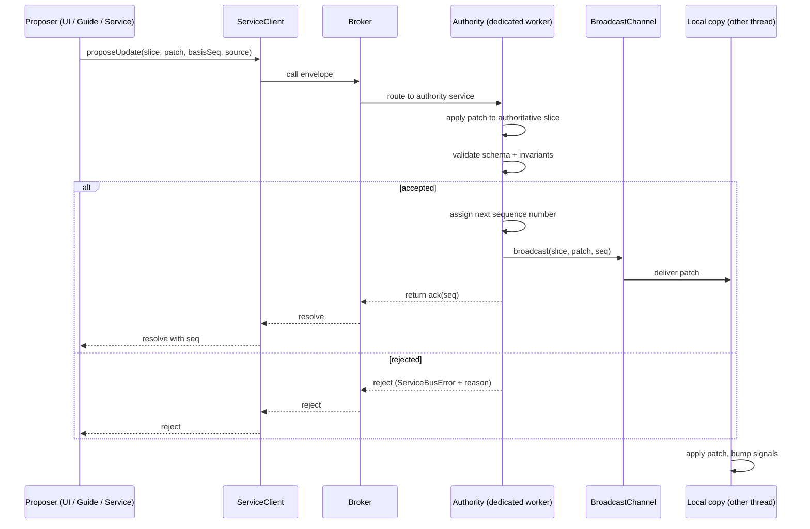

# State manager

## Purpose and scope

This specification defines the state manager: the subsystem that maintains shared live state across all execution threads (the main thread and the service bus's Web Workers), receives proposed updates, enforces invariants, and broadcasts accepted updates as Immer patches over a `BroadcastChannel`. Each thread holds an immutable local copy that changes only by applying those patches, exposed for reactivity through TC39 signals.

It governs:

- the authority — the single process that holds the authoritative copy, receives proposed updates, enforces invariants, and broadcasts accepted patches;
- the local copy — the per-thread immutable snapshot and its TC39-signals reactivity surface;
- the update path — how proposed updates are submitted, validated, accepted or rejected, and broadcast;
- the state model — slices, their schemas, and their invariants;
- the broadcast protocol — Immer patches carried over a named `BroadcastChannel` with monotonic sequence numbers and gap recovery;
- the initialisation protocol — how a local copy obtains the authoritative state on boot;
- the policy parameters owned by this specification.

It is explicitly out of scope for this specification to define:

- the service bus mechanics by which the authority is invoked as a service — which are defined by [Service bus](./service-bus.spec.md);
- the three-way interaction model — the roles of the actors, the permitted interface operations (Navigate, Draw attention, Retrieve), and the interface conflict-resolution rules (User precedence, non-preemption, Guide continuity) — which are defined by [Three-way interaction](./three-way-interaction.spec.md);
- the constrained agent's working memory — the Guide's mutable, cross-interaction JSON state — which remains owned by [Constrained agent](./constrained-agent.spec.md) and is not part of shared state;
- the content model, retrieval interface, and client-side cache — which are defined by [Content model](./content-model.spec.md) and [Content-first retrieval](./content-first-retrieval.spec.md);
- the runtime topology — which subsystems run in which workers — which is defined by [Usage and deployment](./usage-and-deployment.spec.md);
- the concrete field schemas and invariants of the `interface` and `session` slices — which are established by refinement of this specification.

Where this specification depends on behaviour defined by those specifications, it links to them and states its requirement in terms of their observable behaviour, without redefining their mechanisms.

## Design context

Darkling runs across the main thread and several Web Workers (the service bus broker, the Guide agent loop, and the retrieval/cache worker), as defined by [Usage and deployment](./usage-and-deployment.spec.md). Several threads need a consistent view of live state — for example, the currently presented interface, and session/runtime status — and several actors may update that state: the UI from direct User manipulation, the Guide through its permitted tool calls, and services with respect to their own slices.

The state manager provides a single authority that serialises updates, a broadcast medium that fans accepted updates out to every thread without round-tripping each one through the bus, and an immutable, signals-backed local copy that gives each thread a reactive read of the shared state. Proposed updates flow through the [Service bus](./service-bus.spec.md) (for typed, validated invocation and synchronous accept/reject feedback); accepted updates flow back over a peer `BroadcastChannel` (for efficient one-to-many fan-out). This separation keeps the bus for command-style invocations and the channel for state fan-out, matching the distinct communication patterns each serves.

## Architecture



### Authority

The authority is the single process that holds the authoritative copy of the shared state. It runs in a dedicated Web Worker, consistent with the worker topology established by [Usage and deployment](./usage-and-deployment.spec.md).

- The authority must hold the authoritative copy of every slice.
- The authority must be the only process that accepts proposed updates. No other process may mutate the authoritative copy.
- The authority must serialise updates: it must process proposed updates one at a time in arrival order, completing validation and broadcast of one before processing the next.
- The authority is a service on the [Service bus](./service-bus.spec.md). Proposed updates and snapshot requests arrive as bus calls; the authority does not receive patches over the `BroadcastChannel` (it is the sender, not a receiver).

### Local copies

Every thread that needs a reactive read of the shared state holds a local copy. A local copy is a per-thread, immutable snapshot of all slices, updated only by applying broadcast patches.

- A local copy must be read-only with respect to mutation: it must not mutate its snapshot except by applying patches received over the `BroadcastChannel`, and by the initial snapshot fetch defined in [Initialisation](#initialisation).
- A local copy must expose reads through TC39 signals, as defined in [Reactivity](#reactivity).
- A local copy must not accept proposed updates from other threads; proposed updates must be directed to the authority over the bus. (A thread may both hold a local copy and propose updates; proposing is a bus call, not a local mutation.)

### Update path

An update proceeds in three stages:

1. **Propose.** A proposer submits a proposed update to the authority as a bus call, as defined in [Update proposals](#update-proposals).
2. **Validate.** The authority applies the proposed patch to the authoritative slice and enforces the invariants defined in [Invariants](#invariants). The proposal is either accepted or rejected.
3. **Broadcast.** On acceptance, the authority assigns the slice its next monotonic sequence number and broadcasts the patch over the `BroadcastChannel`, as defined in [Broadcast protocol](#broadcast-protocol). On rejection, the authority rejects the bus call; no patch is broadcast.

## State model

### Slices

The shared state is partitioned into a fixed set of named **slices**. Each slice is an independently versioned, independently updated unit of state.

- The set of slices must be fixed and declared up front. Slices must not be registered dynamically at runtime.
- Each slice must declare:
  - a **slice identifier** — a unique name;
  - a **schema** — a Zod v4 schema describing the slice's value;
  - **invariants** — zero or more invariant functions, as defined in [Invariants](#invariants).
- A slice's value must conform to its schema at all times. The authority must not accept any update that would leave the slice's value non-conforming.
- Each slice carries an independent monotonic sequence number, assigned by the authority on each accepted update, as defined in [Broadcast protocol](#broadcast-protocol).

This specification declares that the following slices exist:

- **`interface`** — the live state of the presented Archive interface. The concrete fields of the `interface` slice, and the conflict-resolution invariants it declares, are established by refinement of this specification and must conform to [Three-way interaction](./three-way-interaction.spec.md). The conflict-resolution rules themselves (User precedence, non-preemption, Guide continuity) are defined by [Three-way interaction](./three-way-interaction.spec.md); the `interface` slice's invariants encode and enforce them, they do not redefine them.
- **`session`** — the live session/runtime state not owned by another specification (e.g. interaction status, connection state). The concrete fields of the `session` slice are established by refinement of this specification.

Until a refinement defines a slice's concrete schema, the slice's value is `unknown` and its invariants are empty; the mechanism defined here applies uniformly.

### Immer patches

Accepted updates are represented and broadcast as **Immer patches** — the patch format produced by Immer's `produce` with the patches API.

- The authority must compute the patch for an accepted update as the diff between the slice's pre-update and post-update authoritative values, in the Immer patch format.
- A proposed update must supply its proposed change as an Immer patch against the proposer's last-known snapshot of the slice, together with the basis sequence number of that snapshot, as defined in [Update proposals](#update-proposals).
- The authority must apply a proposed patch to the authoritative slice using Immer's `applyPatch`. If the patch cannot be applied to the authoritative value, the proposal must be rejected.

## Authority

The authority is a service on the [Service bus](./service-bus.spec.md), running in a dedicated Web Worker. It exposes its interface through a `ServiceDeclaration` and `ServiceImplementation`, as defined by [Service bus](./service-bus.spec.md#service-registration).

- The authority's declaration must expose at least the following functions, each with Zod parameter and return schemas:
  - `proposeUpdate` — submit a proposed update for validation and, if accepted, broadcast. Resolves with an acknowledgement on acceptance, rejects with a `ServiceBusError` on rejection, as defined in [Update proposals](#update-proposals).
  - `getSnapshot` — return the current authoritative value of a slice together with its current sequence number. Used for initialisation and gap recovery, as defined in [Initialisation](#initialisation) and [Gap recovery](#gap-recovery).
- The authority must hold the authoritative value and current sequence number of every slice.
- The authority must serialise `proposeUpdate` calls: it must not validate or broadcast a second proposal for a slice until the first has completed (resolved or rejected).
- The authority must not broadcast on rejection. Rejection is communicated solely through the rejected bus call, as defined in [Update proposals](#update-proposals).

## Invariants

The authority enforces invariants on each proposed update before accepting it. There are two invariant categories.

### Schema validity

Every slice has a Zod v4 schema. Schema validity is always enforced.

- The authority must validate the proposed resulting value of the slice against the slice's Zod schema.
- A proposal whose resulting value does not conform to the slice's schema must be rejected with a validation error, as defined in [Rejection](#rejection).

### Slice invariants

A slice may declare zero or more **invariant functions**. An invariant function receives the proposed resulting value and the proposal's `source` (as defined in [Update proposals](#update-proposals)) and returns a verdict — accept or reject with a reason.

- The authority must run every declared invariant function of the slice after schema validation succeeds.
- A proposal is accepted only if schema validation succeeds and every invariant function accepts. If any invariant function rejects, the proposal must be rejected with that invariant's reason, as defined in [Rejection](#rejection).
- Invariant functions must be pure with respect to the proposed resulting value and the proposal's `source`; they must not mutate state or depend on external state.

The motivating use case for slice invariants is **conflict resolution** on the `interface` slice. The `interface` slice's invariants enforce the conflict-resolution rules defined by [Three-way interaction](./three-way-interaction.spec.md) — User precedence, non-preemption of User actions, and Guide continuity — using the proposal's `source` to distinguish User-sourced updates from Guide-sourced updates. The rules themselves are normative in [Three-way interaction](./three-way-interaction.spec.md); this specification requires only that the `interface` slice declare invariants that enforce them, and defines the mechanism by which they are enforced. The concrete `interface` slice invariants are established by refinement of this specification.

## Update proposals

### Proposal structure

A proposed update is submitted as a bus call to `proposeUpdate`. The proposal must contain:

- **`slice`** — the identifier of the slice to update.
- **`patch`** — the proposed Immer patch, generated against the proposer's last-known snapshot of the slice.
- **`basisSeq`** — the sequence number of the slice at which the proposal's patch was generated (the proposer's last-known sequence for the slice).
- **`source`** — the actor proposing the update: `ui`, `guide`, or `service`. The `source` is made available to invariant functions, as defined in [Slice invariants](#slice-invariants).

```ts
// Zod v4
const Proposal = z.object({
  slice: z.string(),
  patch: z.array(z.record(z.string(), z.unknown())), // Immer patch
  basisSeq: z.number().int().nonnegative(),
  source: z.enum(["ui", "guide", "service"]),
});
const Ack = z.object({ seq: z.number().int().nonnegative() });
```

### Optimistic concurrency

Proposals carry a basis sequence number for optimistic concurrency control.

- The authority must compare the proposal's `basisSeq` to the slice's current authoritative sequence number.
- If `basisSeq` does not equal the slice's current sequence number, the authority must reject the proposal with a `StaleBasisError`. The proposal is not applied.
- On a `StaleBasisError`, the proposer should refresh its local copy (via `getSnapshot` or by awaiting pending broadcasts) and recompute its patch against the refreshed snapshot before re-proposing.

This makes staleness explicit: a proposal generated against a snapshot that the authority has since superseded is rejected up front, rather than relying on schema or invariant failure to surface the mismatch.

### Acceptance

On acceptance, the authority must:

1. apply the proposed patch to the authoritative slice, yielding the proposed resulting value;
2. validate the resulting value against the slice's Zod schema;
3. run every declared invariant function of the slice;
4. if all succeed, assign the slice its next monotonic sequence number (current + 1);
5. broadcast the patch with the new sequence number, as defined in [Broadcast protocol](#broadcast-protocol);
6. resolve the `proposeUpdate` call with an acknowledgement carrying the assigned sequence number.

### Rejection

On rejection, the authority must reject the `proposeUpdate` call with a `ServiceBusError` indicating the rejection reason. No patch must be broadcast for a rejected proposal.

Rejection reasons include at least:

- **`StaleBasisError`** — the proposal's `basisSeq` does not match the slice's current sequence number;
- **validation error** — the proposed resulting value does not conform to the slice's Zod schema;
- **invariant rejection** — a slice invariant function rejected the proposal, with the invariant's reason.

The proposer learns the outcome synchronously through the bus call's resolution or rejection, as defined by [Service bus](./service-bus.spec.md#promise-resolution).

```gherkin
Feature: Update proposal lifecycle
  Rule: A proposal is accepted only if its basis is current and the resulting value satisfies schema and invariants

  Scenario: An accepted proposal is broadcast and acknowledged
    Given the authority's current sequence for slice "interface" is 7
    And the UI proposes a patch with basisSeq 7
    When the authority applies the patch
    And the resulting value conforms to the schema
    And all invariant functions accept
    Then the authority must assign sequence 8
    And broadcast the patch with seq 8
    And resolve the proposal with ack { seq: 8 }

  Scenario: A stale-basis proposal is rejected and not broadcast
    Given the authority's current sequence for slice "interface" is 9
    And the Guide proposes a patch with basisSeq 7
    When the authority compares basisSeq to the current sequence
    Then the authority must reject with StaleBasisError
    And must not broadcast any patch

  Scenario: An invariant-rejected proposal is not broadcast
    Given the Guide proposes an interface update that conflicts with established User state
    When the interface slice's conflict-resolution invariant rejects
    Then the authority must reject with an invariant rejection reason
    And must not broadcast any patch
```

## Broadcast protocol

Accepted updates are broadcast as Immer patches over a named `BroadcastChannel`.

### Channel

- The authority and every local copy must communicate patches over a single `BroadcastChannel` whose name is the `Broadcast channel name` policy parameter, as defined in [Policy parameters](#policy-parameters).
- The `BroadcastChannel` is a peer to the [Service bus](./service-bus.spec.md). It carries only state-manager patch messages; it must not carry service bus command envelopes.
- The authority is the sole poster on the channel. Local copies are receivers; they must not post patches.

### Patch message

Each broadcast message must contain:

- **`slice`** — the slice identifier;
- **`patch`** — the Immer patch;
- **`seq`** — the sequence number assigned to this update.

```ts
// Zod v4
const PatchMessage = z.object({
  slice: z.string(),
  patch: z.array(z.record(z.string(), z.unknown())), // Immer patch
  seq: z.number().int().nonnegative(),
});
```

### Ordering and delivery

- The authority must assign sequence numbers monotonically per slice, starting at 0 for the initial snapshot and incrementing by 1 on each accepted update.
- The authority must post patch messages to the `BroadcastChannel` in sequence order per slice.
- A local copy must apply a patch message only if its `seq` is strictly greater than the local copy's last-known sequence for that slice.
- A local copy must ignore a patch message whose `seq` is less than or equal to its last-known sequence (a duplicate or stale delivery).

### Gap recovery

- If a local copy receives a patch message whose `seq` is greater than its last-known sequence plus one, a gap has occurred. The local copy must not apply the patch.
- On a gap, the local copy must re-fetch the authoritative snapshot for that slice via `getSnapshot`, which returns the current value and sequence number, and resume applying patches from the new sequence number.
- While a re-fetch is in flight, the local copy must buffer subsequently received patch messages for that slice and apply them in sequence order once the re-fetch completes, discarding any whose `seq` is less than or equal to the re-fetched sequence number.

```gherkin
Feature: Gap recovery
  Rule: A local copy re-fetches on a sequence gap and resumes from the fresh snapshot

  Scenario: A gap triggers a re-fetch
    Given a local copy's last-known sequence for slice "session" is 5
    When it receives a patch message with seq 8 for slice "session"
    Then it must not apply the patch
    And must call getSnapshot("session")
    And must resume from the returned sequence number

  Scenario: Duplicates are ignored
    Given a local copy's last-known sequence for slice "interface" is 10
    When it receives a patch message with seq 10 for slice "interface"
    Then it must ignore the message
```

## Initialisation

A local copy obtains its initial authoritative state by fetching, not by waiting for a snapshot broadcast.

- On boot, a local copy must fetch the current authoritative snapshot of every slice it consumes via `getSnapshot`, obtaining each slice's value and sequence number.
- A local copy must not apply patch messages for a slice until its initial `getSnapshot` for that slice has resolved, to avoid applying a patch against an uninitialised snapshot.
- After the initial `getSnapshot` resolves, the local copy must apply patch messages whose `seq` is greater than the fetched sequence number, as defined in [Ordering and delivery](#ordering-and-delivery) and [Gap recovery](#gap-recovery).

```gherkin
Feature: Initialisation
  Rule: A local copy fetches the authoritative snapshot on boot before applying patches

  Scenario: Cold start
    Given a local copy has just booted
    When it initialises
    Then it must call getSnapshot for each slice it consumes
    And must not apply patch messages for a slice until that slice's snapshot has resolved

  Scenario: A patch arrives before the snapshot resolves
    Given a local copy has requested getSnapshot("interface") but it has not resolved
    When a patch message for "interface" arrives
    Then the local copy must buffer the message
    And apply it only after the snapshot resolves, if its seq is greater than the fetched seq
```

## Reactivity

A local copy exposes reads of the shared state through TC39 signals (the TC39 signals proposal: `signal`, `computed`, `effect`).

- A local copy must expose reads of slice values through signals compatible with the TC39 signals proposal, so that consumers can subscribe via `computed` and `effect`.
- When a patch is applied to a slice, the local copy must invalidate the signals that read the affected slice, so that dependent `computed` and `effect` re-evaluate.
- The local copy's snapshot must be immutable: applying a patch must produce a new immutable snapshot value, not mutate the existing one in place.
- This specification does not mandate a particular subscription granularity (per-slice, per-path, or single root signal). The granularity is an implementation concern, provided that consumers can observe changes through the signals API.

The specific signals library or polyfill is an implementation concern, provided it is compatible with the TC39 signals proposal API.

## Policy parameters

This specification owns the following policy parameters, which must satisfy the contract defined by [Policy and configuration](./policy-and-configuration.spec.md).

| Name | Governs | Type |
| --- | --- | --- |
| `Broadcast channel name` | The name of the `BroadcastChannel` used by the authority and all local copies for patch broadcast. Must be consistent across all threads. | string |

| Name | Description |
| --- | --- |
| `Broadcast channel name` | The authority and every local copy must use the same `BroadcastChannel` name. An implementation must provide a defined value; mismatched names result in local copies that never receive patches. |

Additional policy parameters (e.g. retry behaviour for `StaleBasisError`, snapshot fetch timeout) may be introduced by refinement of this specification. Until then, their behaviour is implementation-defined.

## Conformance

An implementation of the state manager must:

- run a single authority in a dedicated Web Worker, as defined in [Authority](#authority);
- expose `proposeUpdate` and `getSnapshot` as a service on the [Service bus](./service-bus.spec.md);
- serialise `proposeUpdate` calls and enforce schema validity and slice invariants, as defined in [Invariants](#invariants);
- enforce optimistic concurrency via `basisSeq`, as defined in [Optimistic concurrency](#optimistic-concurrency);
- broadcast accepted patches over a named `BroadcastChannel` with monotonic per-slice sequence numbers, as defined in [Broadcast protocol](#broadcast-protocol);
- provide local copies that fetch initial snapshots on boot, apply patches in sequence, recover from gaps, and expose reads through TC39 signals, as defined in [Initialisation](#initialisation), [Gap recovery](#gap-recovery), and [Reactivity](#reactivity);
- reject proposals through the bus call and never broadcast on rejection, as defined in [Rejection](#rejection).

```gherkin
Feature: Single authority serialisation
  Rule: Only the authority accepts updates, and it processes them one at a time

  Scenario: Concurrent proposals are serialised
    Given two proposals for slice "interface" arrive at the authority
    When the authority processes them
    Then it must process them in arrival order
    And must complete validation and broadcast of the first before processing the second
    And each accepted proposal must receive a distinct, monotonically increasing sequence number
```